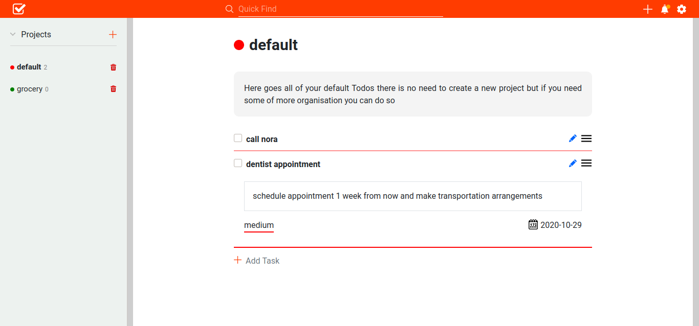

# TODO-List
> This is a simple task managament app built with javascript. The project specification can be found [here](https://www.theodinproject.com/courses/javascript/lessons/todo-list). The aim of this project was to make use of single responsibility and tightly coupled Objects, modularized code and webpack.

## Built With

- HTMl,
- CSS,
- Javascript

## Live Demo

[Live Demo Link](https://misterpaul4.github.io/TODO-List/)

## Getting Started

- Clone the repository to get a local copy `git clone https://github.com/misterpaul4/TODO-List`
- In the project's directory, install dependencies by running `npm install`
- `npm run build` to compile 
- `npm run server` to run locally.

## Authors

👤 **Chukwuebuka Paul Ajuizeogu**
- Github: [@misterpaul4](https://github.com/misterpaul4)
- Twitter: [@paulajuze](https://twitter.com/paulajuze)
- Linkedin: [Chukwuebuka Paul Ajuizeogu](https://www.linkedin.com/in/chukwuebuka-paul-ajuizeogu/)

👤 **Zakariae El Mejdki**

- Github: [@elmejdki](https://github.com/elmejdki)
- Twitter: [@zakariae_elmejdki](https://twitter.com/zakariaemejdki)
- Linkedin: [El Mejdki Zakariae](https://www.linkedin.com/in/zakariaeelmejdki/)

## 🤝 Contributing

Contributions, issues and feature requests are welcome!

Feel free to check the [issues page](issues/).

## Show your support

Give a ⭐️ if you like this project!

## 📝 License

This project is [MIT](lic.url) licensed.